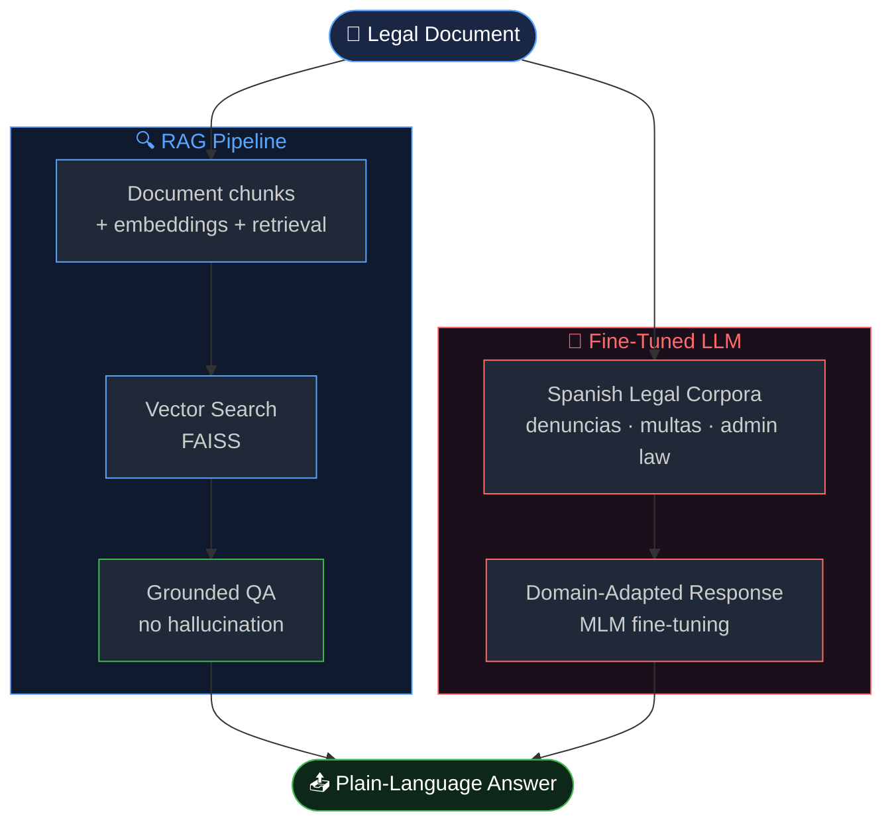

<div align="center">

<!-- HEADER -->


<!-- BADGES -->
[](https://python.org)
[](https://jupyter.org)
[](#architecture)
[](#fine-tuning)
[](https://huggingface.co)
[](LICENSE)
[](https://colab.research.google.com)

<br/>

> **LexAIcon makes the law understandable for everyone.**
> An AI system that translates, summarizes, and explains legal documents in plain language —
> combining RAG pipelines and custom fine-tuned LLMs trained on real Spanish legal data.

<br/>

[](https://colab.research.google.com/github/manuelcozar55/LexAIcon/blob/main/LexAIcon.ipynb)
[](https://colab.research.google.com/github/manuelcozar55/LexAIcon/blob/main/FTLexAIcon.ipynb)

</div>

---

## ⚖️ The Problem

Legal language is intentionally complex. A standard traffic fine, a lease clause, or a public complaint form can be incomprehensible to non-lawyers — even in your native language. In Spain alone, millions of citizens interact with legal documents every year without understanding their full implications.

**LexAIcon bridges that gap with AI.**

---

## 🎯 What It Does

| Capability | Input | Output |
|------------|-------|--------|
| **Translate** | Legal jargon in any register | Plain-language equivalent |
| **Summarize** | Full legal documents | Concise, actionable summary |
| **Explain** | Specific clauses or terms | Step-by-step explanation with context |
| **Answer** | Questions about legal content | Grounded answers via RAG (no hallucination) |

---

## 🏗️ Architecture

LexAIcon combines two complementary AI approaches for maximum accuracy:



### Why both RAG and Fine-Tuning?

| Approach | Strength | Used for |
|----------|----------|----------|
| **RAG** | Grounded in source documents, no hallucination | Q&A on specific documents provided by user |
| **Fine-Tuning** | Domain vocabulary, Spanish legal register | Style adaptation, term explanation, summarization |

Using only fine-tuning risks outdated knowledge. Using only RAG lacks legal domain fluency. **LexAIcon uses both.**

---

## 📦 Dataset

The models were trained and evaluated on **real Spanish legal data**:

| File | Content | Records |
|------|---------|---------|
| `denuncias.json` | Police complaints and incident reports (Zaragoza) | ~N complaints |
| `multas_zgz.json` | Municipal traffic fines (Zaragoza) | ~N penalties |
| `MLM_Fine_tunned/` | Masked Language Modeling fine-tuned model artifacts | — |

> **Why Zaragoza data?** Proximity to real, local, verifiable ground truth — not synthetic data. This grounds the model in actual administrative and legal language used in Spanish public institutions.

---

## 🚀 Quick Start

### Option A — Google Colab (recommended, no setup needed)

| Notebook | Purpose |
|----------|---------|
| [](https://colab.research.google.com/github/manuelcozar55/LexAIcon/blob/main/LexAIcon.ipynb) **LexAIcon.ipynb** | Main demo: translate, summarize, explain |
| [](https://colab.research.google.com/github/manuelcozar55/LexAIcon/blob/main/FTLexAIcon.ipynb) **FTLexAIcon.ipynb** | Fine-tuning pipeline with your own data |

### Option B — Local

```bash
git clone https://github.com/manuelcozar55/LexAIcon.git
cd LexAIcon
pip install transformers datasets torch accelerate faiss-cpu langchain
jupyter notebook LexAIcon.ipynb
```

---

## 💬 Example Outputs

**Input** (original legal text):
```
"El expediente sancionador incoado al amparo del artículo 91.2 del Real Decreto
Legislativo 6/2015, de 30 de octubre, por el que se aprueba el texto refundido de
la Ley sobre Tráfico..."
```

**LexAIcon output** (plain language):
```
Se ha abierto un procedimiento sancionador contra usted por una infracción
de tráfico. Según la ley española de tráfico (artículo 91.2), usted tiene
derecho a presentar alegaciones en un plazo de 20 días naturales.

En resumen: le han puesto una multa y puede recurrir en 20 días.
```

---

## 📁 Project Structure

```
LexAIcon/
├── LexAIcon.ipynb          # Main notebook — full pipeline demo
├── FTLexAIcon.ipynb        # Fine-tuning notebook (MLM + instruction tuning)
├── MLM_Fine_tunned/        # Saved fine-tuned model artifacts
├── denuncias.json          # Training data: police complaints
├── multas_zgz.json         # Training data: municipal fines (Zaragoza)
└── LICENSE                 # Apache 2.0
```

---

## 🔑 Technical Highlights

- **Masked Language Modeling (MLM) fine-tuning** on Spanish legal corpus to adapt base model vocabulary to legal register
- **RAG implementation** using document chunking, embedding, FAISS vector search, and retrieval-augmented generation
- **Real-world data**: trained on actual municipal and administrative records from Zaragoza public datasets
- **Bilingual capability**: handles both Spanish legal text and plain-language explanations
- **Google Colab compatible**: full pipeline runnable without local GPU

---

## 🗺️ Roadmap

- [ ] Web interface (Streamlit / Gradio demo)
- [ ] Support for EU-level legal documents (GDPR, DORA)
- [ ] Multi-document cross-referencing
- [ ] API endpoint for integration with legal tools
- [ ] Expanded dataset with national legislation

---

## 👤 Author

**Manuel Antonio Cózar Baranguán**
*AI Engineer & Innovation Researcher*

[](https://linkedin.com/in/manuelcozarb)
[](https://github.com/manuelcozar55)
[](mailto:manuelcozarb@gmail.com)

---

<div align="center">

*Making the law legible — one document at a time.*


</div>
